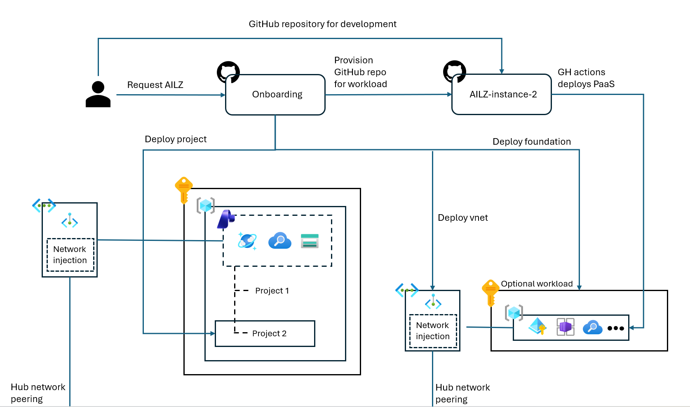

# AI Landing Zone

This repository is a demo, not a production-ready landing zone. Use it to learn, prototype, and discuss AI Landing Zone onboarding patterns before adapting the ideas for a governed platform.



## What it shows

- A manifest-driven onboarding flow for AI Landing Zones.
- Terraform automation that creates a downstream workload repository, deployment identity, GitHub variables, and a central Microsoft Foundry project.
- A shared platform foundation with one central Microsoft Foundry / AI Services account and shared capability-host resources.
- Bootstrapped Bicep content that downstream workload repositories can use to deploy optional workload resources such as monitoring, private endpoints, Storage, Cosmos DB, AI Search, Key Vault, ACR, App Configuration, and Container Apps Environment.

## Important networking note

The networking module in this repository is only a vibecoded placeholder. It exists so the demo can run end to end, but adopting teams are expected to replace it with their own governed network modules, VNet vending, IPAM, DNS, routing, firewall, peering, approval, and policy processes.

Keep the contract, not the implementation: onboarding and downstream workload deployments need the resulting VNet, subnet, peering, and Private DNS zone IDs. Those values can come from your own networking platform instead of `networking-example-remove`.

## Flow

```text
1. Deploy or reference shared connectivity and Private DNS outputs.
2. Deploy platform-foundation and publish outputs to manifests/_shared/platform-foundry.json.
3. Add a manifest under manifests/<app-id>.
4. Run the Onboard AI Landing Zone workflow.
5. Terraform creates the downstream repo, identity, Foundry project, and required variables.
6. The downstream repo deploys optional workload resources with its IaC Deploy workflow.
```

## Repository layout

| Path | Purpose |
| --- | --- |
| `manifests/` | One folder per onboarding request plus shared platform metadata. |
| `platform-foundation/` | Central Microsoft Foundry account and shared capability-host resources. |
| `onboarding/` | Terraform onboarding automation. |
| `spoke-bootstrapped-content/` | Content copied into downstream workload repositories. |
| `networking-example-remove/` | Placeholder networking example for the demo only. Replace this when adopting the pattern. |

## Getting started

1. Put shared connectivity outputs in `manifests/_shared/hub-network.json`, or adapt onboarding to read them from your network platform.
2. Deploy `platform-foundation/main.bicep` and publish its outputs to `manifests/_shared/platform-foundry.json`.
3. Copy `manifests/example` to `manifests/<app-id>` and update `meta-data-onboarding.json` and `main-parameters.json`.
4. Run the `Onboard AI Landing Zone` GitHub Actions workflow with the manifest path, for example `manifests/1349`.
5. Deploy workload resources from the generated `az-ailz-<app-id>` downstream repository.

## Required setup

- Azure permissions to create resource groups, managed identities, role assignments, deployments, and any required network resources.
- Access to create repositories in the target GitHub organization.
- Repository secrets: `AZURE_CLIENT_ID`, `AZURE_TENANT_ID`, and `GH_ORG_ADMIN_TOKEN`.
- Terraform for local onboarding runs.
- Azure CLI for local Bicep builds and deployments.

## More details

- [manifests/README.md](manifests/README.md)
- [platform-foundation/README.md](platform-foundation/README.md)
- [onboarding/README.md](onboarding/README.md)
- [spoke-bootstrapped-content/IaC/README.md](spoke-bootstrapped-content/IaC/README.md)
- [networking-example-remove/README.md](networking-example-remove/README.md)
